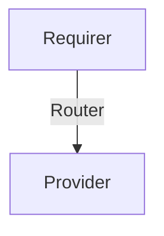

# Router

## Usage

This relation interface describes the expected behavior of any charm claiming to be able to provide or require a router.

## Direction



As all Juju relations, the router interface consists of a provider and a requirer. The provider will be expected to stand up a router where the Requirer will be expected to provide routes.

## Behavior

Both the Requirer and the provider need to adhere to a certain set of criterias to be considered compatible with the interface.

### Provider

#### Behavior 1
- **Given**: Gateway address and gateway name in relation data
- **When**: Relation Joined
- **Then**: A network interface is added

#### Behavior 2
- **Given**: A route is in remote unit relation data
- **When**: Relation Changed
- **Then**: The route is created


## Relation Data

### Provider


### Requirer


#### Examples
```json title="core.yaml"
{
  "name": "core",
  "gateway": "192.168.250.1/24",
  "routes": [
    {
      "network": "172.250.0.0/16",
      "gateway": "192.168.250.3",
    }
  ]
}
```


```json title="ran.yaml"
{
  "name": "ran",
  "gateway": "192.168.251.1/24",
}
```

```json title="access.yaml"
{
  "name": "access",
  "gateway": "192.168.252.1/24"
}
```
